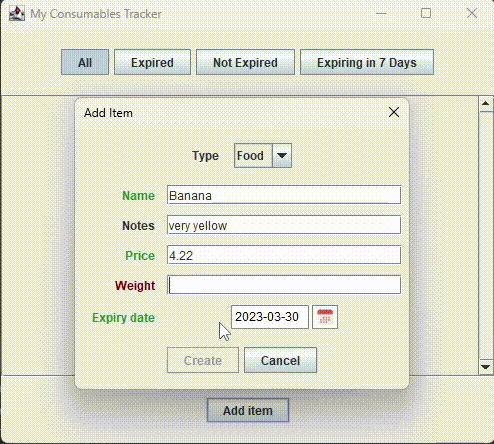

# Consumable Tracker (Client)

This client program uses the MVC pattern with Java OOP and Swing, AWT, Gson, and HttpURLConnection to implement a GUI allowing the user to keep track of a custom Consumable object type.

The client communicates with ConsumableTrackerServer to send and receive serialized Consumable objects. All input validation is handled by the client using type-responsive Swing objects like coloured text, button reveals, balloon tooltips and message boxes.

The client can request to add or remove Consumable objects from the server, and fetch an updated list of objects.